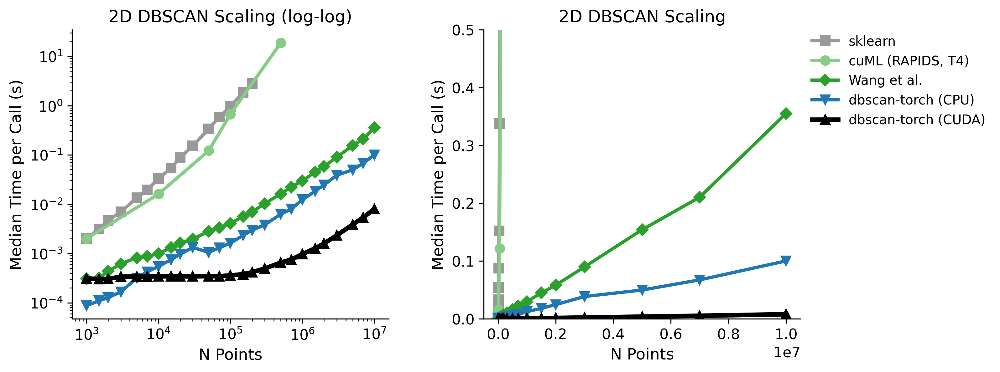

# dbscan-torch

[](LICENSE)

GPU-accelerated 2D DBSCAN as a native PyTorch op. Tensor in, tensor out, on
the same device, with no host to device round-trip. Parallel CPU and CUDA
implementations, dispatched automatically on `X.device`.

Based on the grid-hashing approach from [Wang et al. (SIGMOD 2020)][wang-paper],
reimplemented as a native PyTorch extension with CUDA support.

## Install

    pip install dbscan-torch

CPU-only wheels work out of the box on Linux and macOS (not tested in Windows).
Building with CUDA requires the CUDA toolkit and a CUDA-enabled torch install at
build time.

### Installing alongside a pinned torch

The C++ extension is built against whatever torch lands in pip's isolated
build environment. If your runtime env has torch pinned to a version that
differs from "latest in the supported range," the build will compile
against the build-env torch and fail to import against your runtime torch
(PyTorch does not preserve binary compatibility across minor versions).
`dbscan-torch` detects this on import and tells you exactly what to do.
The fix is to build against your existing torch:

    pip install --no-build-isolation dbscan-torch

## Use

```python
import torch
from dbscan_torch import dbscan2d

X = torch.randn(100_000, 2, device="cuda")
labels = dbscan2d(X, eps=0.5, min_samples=10)
# labels: int32 tensor of shape (N,) on the same device as X.
# -1 = noise, otherwise a cluster id in [0, n_clusters).
```

X must be a float32 tensor of shape `(N, 2)`. The function dispatches to the
CPU or CUDA implementation automatically based on `X.device`. Thread count
for the CPU path follows `torch.get_num_threads()`, which is the same method that
controls parallelism for any other torch op.

See `examples/` for runnable scripts.

## Why this exists


`sklearn.cluster.DBSCAN` is single-threaded CPU and forces you to copy your
tensor off the device, cluster, then copy labels back. `dbscan-torch` keeps
the whole pipeline on the GPU while being magnitudes faster than sklearn and
lighter than [`dbscan-python`][dbscan-python-repo], while also supporting GPU
acceleration for massive gains on large N.

| Implementation | Parallelism | Output | Sweet Spot |
|---|---|---|---|
| `sklearn.cluster.DBSCAN` | single-threaded CPU | numpy | small N, prototyping |
| [cuml.DBSCAN][cuml-repo] (RAPIDS) | CUDA | cupy / numpy | RAPIDS ecosystem |
| [Wang et al.][wang-paper] (`pip install dbscan`) | parallel CPU | numpy | CPU without torch |
| `dbscan-torch` (this) | parallel CPU + CUDA | torch tensor | torch pipelines; fastest measured here on CUDA from N ~ 2k and on CPU from N ~ 5k |

The third row is the reference implementation of Wang et al.,
"Theoretically-Efficient and Practical Parallel DBSCAN" (SIGMOD 2020),
distributed as the [`dbscan-python`][dbscan-python-repo] package
(`pip install dbscan`).

[wang-paper]: https://dl.acm.org/doi/10.1145/3318464.3380582
[dbscan-python-repo]: https://github.com/wangyiqiu/dbscan-python
[cuml-repo]: https://github.com/rapidsai/cuml

## Scaling

<center>
    
</center>

Median time per call (11 timed calls after a warmup) against N, on
synthetic 2D Gaussian clusters at constant density (eps=0.3,
min_samples=5). sklearn, Wang et al., and both `dbscan-torch` paths were
measured on one workstation (AMD Ryzen 9 7900X, RTX 3090). The
cuml.DBSCAN line is carried from an earlier run on a Modal T4 (it is
included for reference; it scales poorly on 2D inputs in this benchmark
and caps out by 500k).

`sklearn` goes off-scale past 200k. The CUDA line stays under 10ms across
the whole range while the CPU implementations scale linearly. At 10M
points `dbscan-torch` on CUDA is ~44x faster than Wang et al. and ~13x
faster than the torch CPU path, and the torch CPU path is ~3.5x faster
than Wang et al.


### Benchmark Details

Seconds per call, median of 11:

| N          | sklearn | Wang et al. | torch CPU | torch CUDA | CUDA vs Wang et al. |
|------------|--------:|------------:|----------:|-----------:|--------------------:|
| 1,000      |   0.002 |      <0.001 |    <0.001 |     <0.001 |      0.99x (slower) |
| 10,000     |   0.033 |      <0.001 |    <0.001 |     <0.001 |              2.9x   |
| 50,000     |   0.338 |       0.003 |     0.001 |     <0.001 |              8.2x   |
| 100,000    |   0.963 |       0.004 |     0.002 |     <0.001 |             11.4x   |
| 500,000    |       - |       0.016 |     0.006 |     <0.001 |             24.8x   |
| 1,000,000  |       - |       0.030 |     0.012 |      0.001 |             31.0x   |
| 5,000,000  |       - |       0.154 |     0.050 |      0.004 |             39.9x   |
| 10,000,000 |       - |       0.355 |     0.100 |      0.008 |             44.4x   |

(- means run skipped: sklearn exceeds 3s per call past 200k.)

## Author

Ryan Peters

## License

MIT. See [LICENSE](LICENSE).


